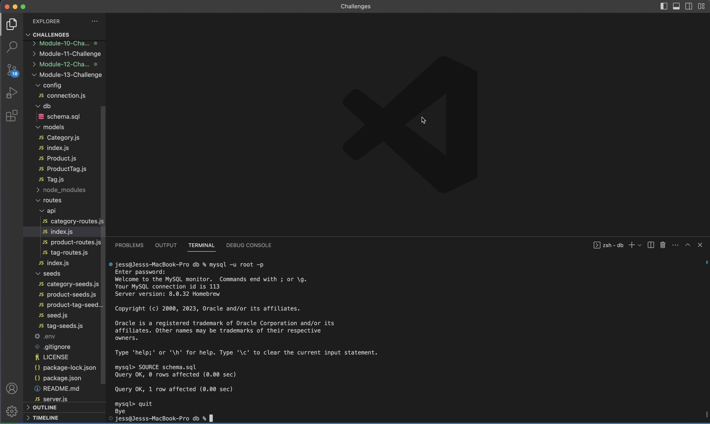
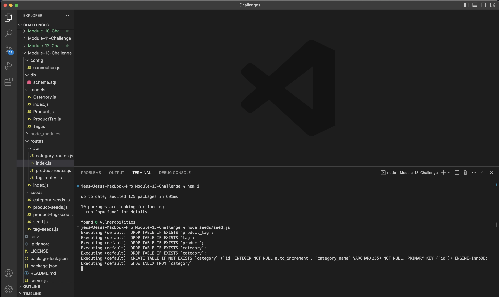
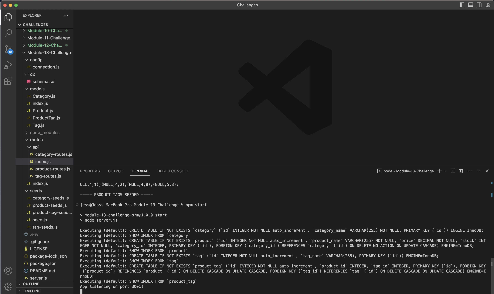
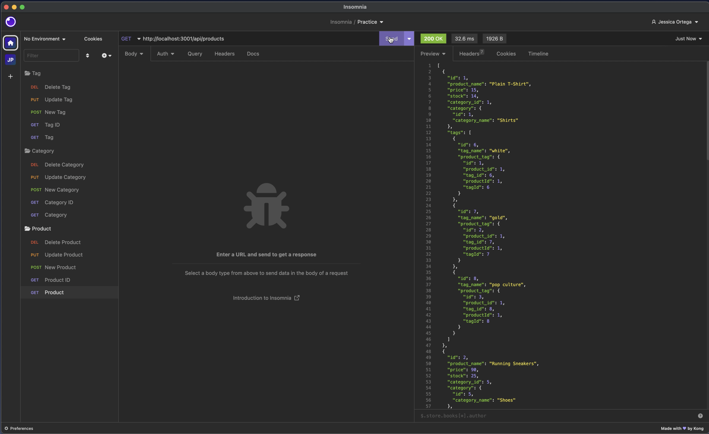

# Module-13-Challenge
Object-Relational Mapping (ORM): E-Commerce Back End

  ## Table of Contents
  - [Description](#Description)
  - [Usage](#Usage)
  - [Installation](#Installation)
  - [Credits](#Credits)
  - [Questions](#Questions)
  - [License](#License)

  ## Description
  
  One can see how the back end for an e-commerce site is configured and how products, categories, and tags interact with each other., as well as, how to edit each by changing or deleting excisting data.
  
  ## Usage
  In here you can see the steps to run the application and make some tests via Insomnia.

-How to create the schema from the MySQL shell
  

-How to seed the database from the command line
  

-How to start the application’s server

-Routes for all categories, all products, and all tags being tested in Insomnia

  ## Installation
  It uses Express.js, Sequelize, and MySQL
  Insomnia to test routes

  ## Credits
  N/A

  ## Questions
  jes.ortega7@gmail.com
  https://github.com/JessicaIOrtega

  ## License
  ### [MIT](https://choosealicense.com/licenses/mit/)
  ### 
  
  ### Copyright (c) [year] [fullname]    Permission is hereby granted, free of charge, to any person obtaining a copy of this software and associated documentation files (the "Software"), to deal in the Software without restriction, including without limitation the rights to use, copy, modify, merge, publish, distribute, sublicense, and/or sell copies of the Software, and to permit persons to whom the Software is furnished to do so, subject to the following conditions: The above copyright notice and this permission notice shall be included in all copies or substantial portions of the Software. THE SOFTWARE IS PROVIDED "AS IS", WITHOUT WARRANTY OF ANY KIND, EXPRESS OR IMPLIED, INCLUDING BUT NOT LIMITED TO THE WARRANTIES OF MERCHANTABILITY, FITNESS FOR A PARTICULAR PURPOSE AND NONINFRINGEMENT. IN NO EVENT SHALL THE AUTHORS OR COPYRIGHT HOLDERS BE LIABLE FOR ANY CLAIM, DAMAGES OR OTHER LIABILITY, WHETHER IN AN ACTION OF CONTRACT, TORT OR OTHERWISE, ARISING FROM, OUT OF OR IN CONNECTION WITH THE SOFTWARE OR THE USE OR OTHER DEALINGS IN THE SOFTWARE.
